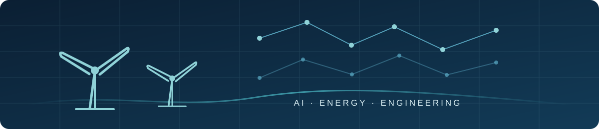

  

<h1 align="center">Nurali Gabdushev</h1>

  Student researcher and developer interested in AI for engineering systems, with a particular focus on computer vision, scientific computing, optimization, and renewable energy. I build reproducible technical projects that connect rigorous modeling and evaluation with practical software.

  
  
  

## Selected Projects

### ◉ BladeScope

Computer-vision research on wind-turbine blade defect recognition under limited data and controlled image degradation.

- 720 retained full images and 1,065 annotated defect instances across six classes
- HOG/LBP baselines, ResNet-18, MobileNetV3-Small, and YOLO11n localization
- Data-efficiency, robustness, Grad-CAM, blinded-review, and multi-seed evaluation
- Clean CNN macro-F1 means near `0.895`; the paired interval supports neither superiority nor equivalence

**[Repository](https://github.com/Stukhori/BadeScope) · [Live Demo](https://bladescope.streamlit.app/)**

### ⚡ SteppeGrid

An interactive renewable-microgrid planning platform for rural Kazakhstan.

- Hourly weather and electricity-demand modeling
- Wind and solar generation with battery dispatch
- Reliability-constrained optimization and planning economics
- Streamlit planner for registered and configurable sites

**[Repository](https://github.com/Stukhori/SteppeGrid)**

### ▦ ModelMind

A Flask application for natural-language analysis of Excel workbooks.

- Workbook-grounded analysis with pandas and openpyxl
- Single- and multi-sheet inspection and comparison
- Trend, data-quality, and shared-column analysis
- Natural-language responses through the Gemini API

**[Repository](https://github.com/Stukhori/HUVTSP-Modelmind)**

## Current Focus

- Robust computer vision for renewable-energy infrastructure
- Renewable microgrid modeling and optimization
- Reproducible AI systems for engineering applications

## Engineering Approach

I emphasize reproducibility, traceable assumptions, controlled evaluation, and results that can be checked against code or machine-readable artifacts. I keep model and data boundaries explicit, use source-aware splits and multi-seed evaluation where appropriate, and document limitations alongside results.

## Technical Interests

Machine Learning · Computer Vision · Scientific Computing · Optimization · Data Analysis · AI for Engineering Systems
